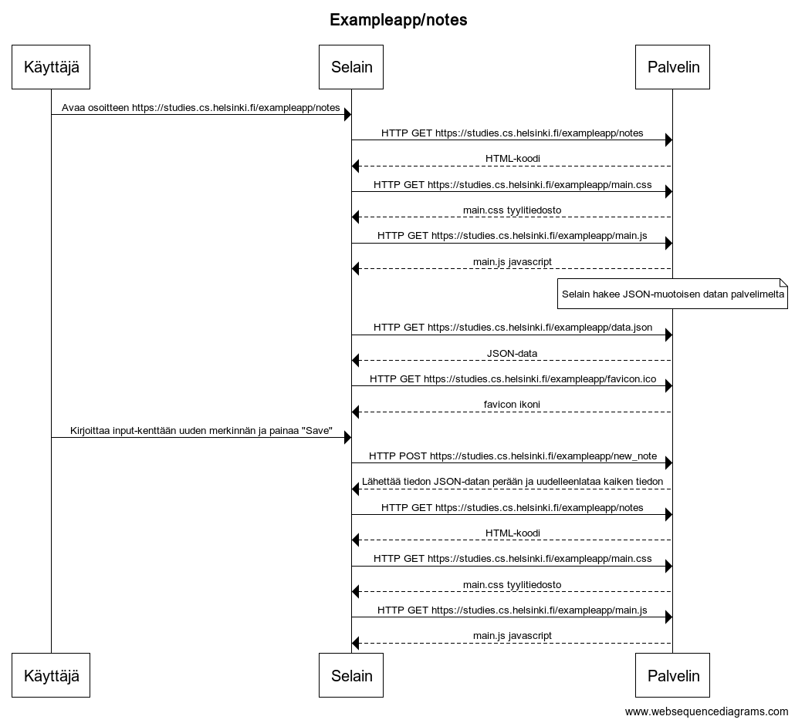
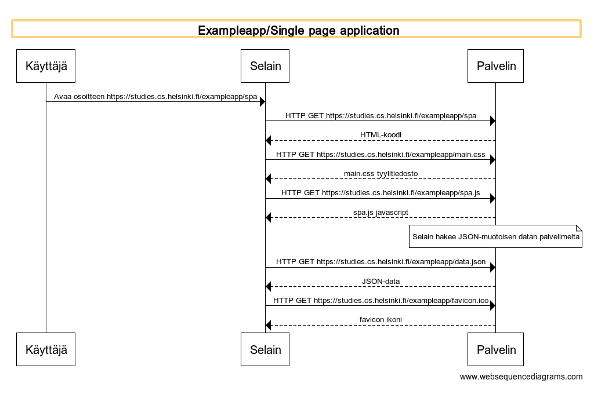
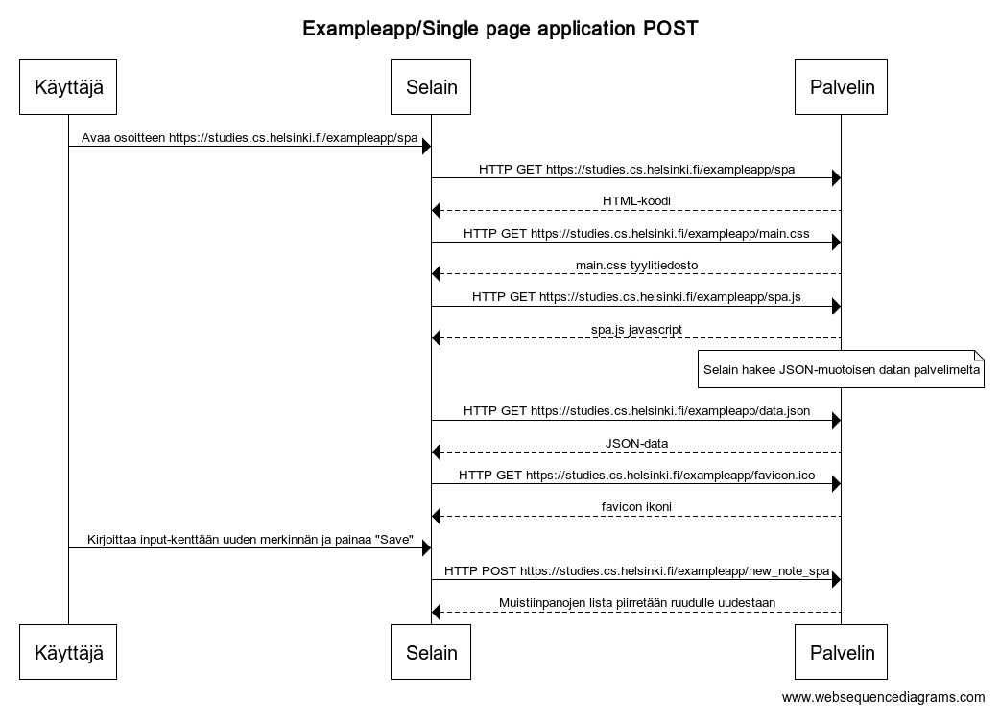

# Full stack open 2022

## Täällä voit tarkastella edistymistäni vuoden 2022 Full Stack Open nettikurssilla, jonka tarjoaa Helsingin yliopisto

## Here you can track my progress in the Full Stack Open 2022 online course provided by the University of Helsinki

## Osio 0 / Section 0

#### 0.4

#### 0.5

#### 0.6

## Osio 1 / Section 1

## Osio 2 / Section 2

## Osio 3 / Section 3

### Heroku app 

##### [front-end](https://agile-bastion-64132.herokuapp.com/)
##### [back-end](https://agile-bastion-64132.herokuapp.com/api/persons/)
##### [repository](https://github.com/ToniCantarella/fullstackopen2022osa3)

#### 